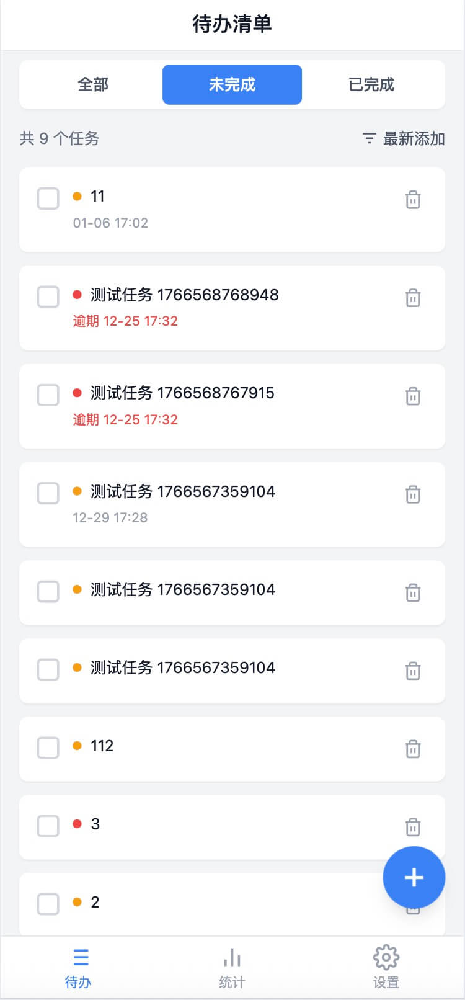
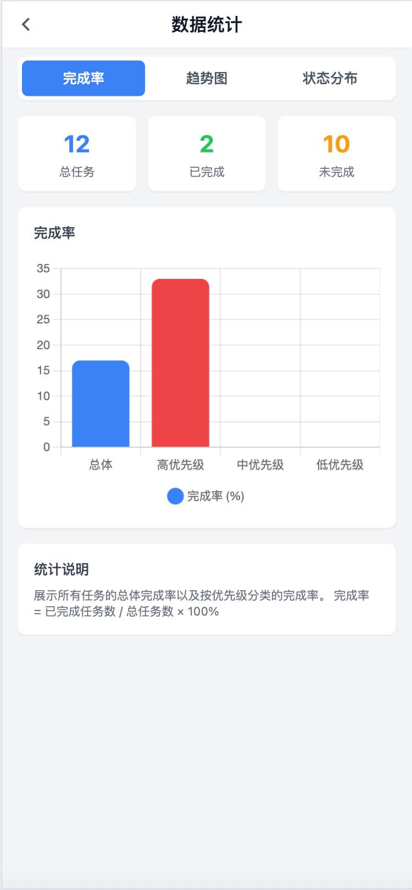
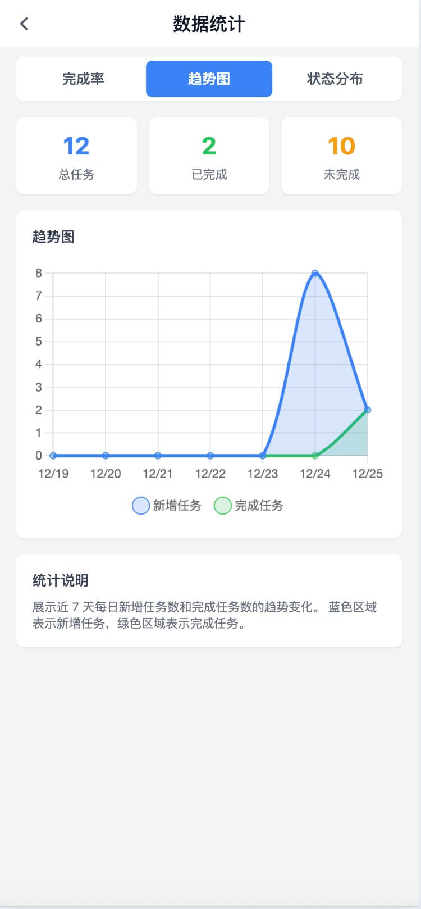
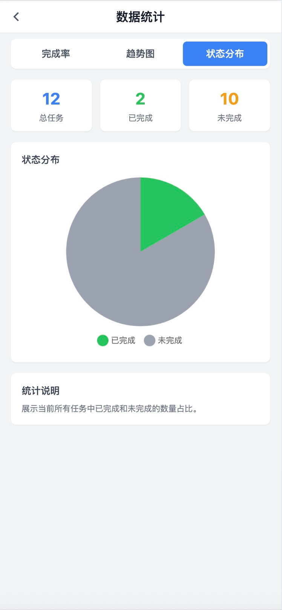
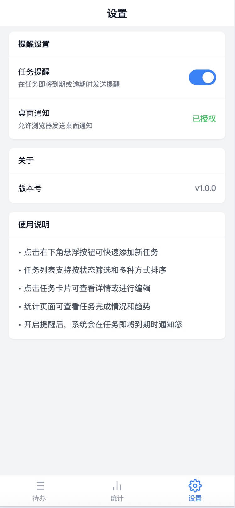

# 移动端 H5 待办清单应用

这是一个移动端 H5 待办清单应用，包含两个独立的技术实现版本：

- **angular-h5/** - Angular 20 + TypeScript 实现版本
- **react-h5/** - React 19 + Vite + TypeScript 实现版本
- **docs-api/** - 后端 API 接口文档

## 功能特性

| 功能模块 | 描述 |
|---------|------|
| 任务列表 | 支持筛选（全部/未完成/已完成）、排序（最新/截止/优先级） |
| 任务管理 | 新增/编辑任务，支持标题、描述、截止时间、优先级设置 |
| 任务详情 | 完整信息展示，状态管理（完成/未完成） |
| 数据统计 | Chart.js 图表展示完成率、趋势、状态分布 |
| 提醒功能 | 长轮询获取提醒，浏览器桌面通知 |

## 应用截图

> **注意**：Angular 版本和 React 版本的 UI 显示效果完全一致












## 技术栈对比

| 技术选型 | Angular 版本 | React 版本 |
|---------|-------------|-----------|
| 框架 | Angular 20.3 | React 19 |
| 构建工具 | Angular CLI | Vite 7 |
| 语言 | TypeScript 5.9 | TypeScript 5.9 |
| 状态管理 | Signals | Custom Hooks |
| 路由 | @angular/router | react-router |
| 样式 | SCSS + Tailwind CSS v3 | SCSS + Tailwind CSS v3 |
| 图表 | Chart.js | Chart.js (react-chartjs-2) |
| 时间处理 | Day.js | Day.js |

## 快速开始

### Angular 版本

```bash
cd angular-h5
npm install
npm start
# 访问 http://localhost:4200
```

### React 版本

```bash
cd react-h5
npm install
npm run dev
# 访问 http://localhost:5173
```

## 项目结构

```
code-test/
├── angular-h5/          # Angular 实现版本
│   └── src/app/
│       ├── core/        # 核心服务、API 封装
│       ├── features/    # 页面组件
│       └── shared/      # 共享组件
├── react-h5/            # React 实现版本
│   └── src/
│       ├── api/         # API 接口封装
│       ├── components/  # 通用组件
│       ├── hooks/       # 自定义 Hooks
│       ├── pages/       # 页面组件
│       └── utils/       # 工具函数
└── docs/                # 项目文档
    └── h5需求分析.md
```

## 开发命令

### Angular 项目

```bash
cd angular-h5

# 启动开发服务器
npm start

# 构建生产版本
npm run build

# 运行单元测试
npm test

# 代码脚手架
ng generate component component-name
ng generate service service-name
```

### React 项目

```bash
cd react-h5

# 启动开发服务器
npm run dev

# 构建生产版本
npm run build

# 代码检查
npm run lint

# 预览构建结果
npm run preview
```

## 技术对比总结

| 对比维度 | Angular | React |
|---------|---------|-------|
| 学习曲线 | 陡峭，概念多 | 平缓，上手快 |
| 代码规范 | 高度统一 | 灵活自由 |
| 代码量 | 样板代码多 | 更简洁 |
| 状态管理 | Signals 更优雅 | Hooks 需更多经验 |
| 开箱即用 | 功能完善 | 需自行组合 |
| 构建速度 | 快 | 极快 (Vite) |
| 包大小 | 较大 | 较小 |

详细对比分析请参考开发文档。

## API 接口

所有接口统一响应格式：

```typescript
{
  success: boolean,
  data: T,
  message: string,
  error?: { code: string, message: string, details: string },
  timestamp: string
}
```

| 接口 | 方法 | 路径 |
|:---|:---|:---|
| 获取任务列表 | GET | `/api/tasks` |
| 获取单个任务 | GET | `/api/tasks/{id}` |
| 创建新任务 | POST | `/api/tasks` |
| 更新任务 | PUT/PATCH | `/api/tasks/{id}` |
| 删除任务 | DELETE | `/api/tasks/{id}` |
| 标记完成 | PATCH | `/api/tasks/{id}/complete` |
| 标记未完成 | PATCH | `/api/tasks/{id}/pending` |
| 获取提醒 | GET | `/api/reminders` |

详细 API 文档请参考 `docs-api/README.md`。

## 开发规范

- 类型定义接口名称以大写字母 `I` 开头（如 `IUserData`）
- 遵循函数式编程范式，优先使用纯函数
- 组件保持单一职责，使用组合而非继承
- 逻辑与 UI 分离
- 每个文件顶部必须包含文件说明注释
- 单个代码文件不超过 300 行

## License

MIT
